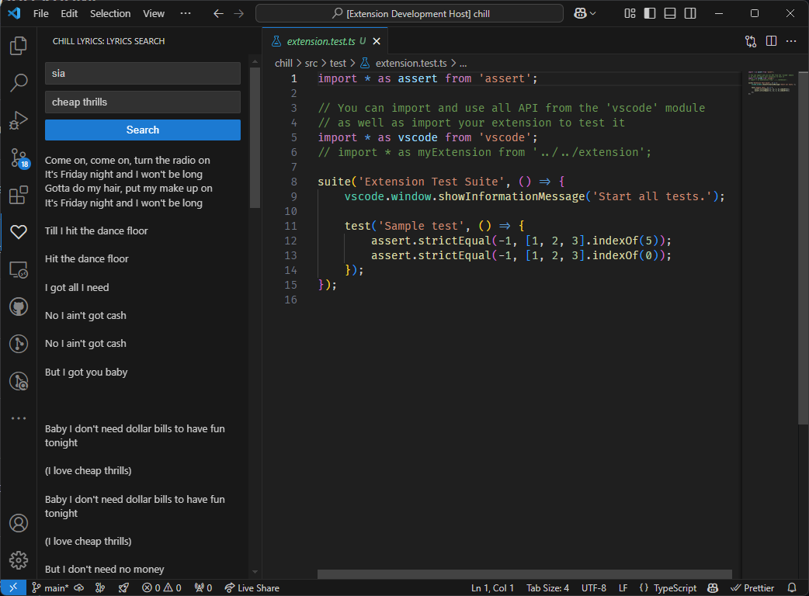

# Chill Lyrics

Search and view song lyrics directly in the VSCode sidebar. No authentication required, just install and start searching for your favorite songs!

## Features

- Search for song lyrics by song title or artist.
- View lyrics in a dedicated sidebar panel.
- Copy lyrics to the clipboard.
- Supports multiple languages.

## Why?

I sometimes find myself listening to music while coding, and I often want to look up the lyrics to a song. This extension allows me to do that without leaving the editor.

## Requirements

No additional requirements or dependencies are needed for this extension.

## Extension Settings

This extension contributes the following settings:

- `chillLyrics.enable`: Enable/disable the Chill Lyrics extension.

## Known Issues

Currently, there are no known issues. If you encounter any problems, please report them on the [issue tracker](https://github.com/tomlin7/chill-lyrics).

## Release Notes

Users appreciate release notes as you update your extension.

### 0.0.1

Initial release of Chill Lyrics.

**Enjoy using Chill Lyrics!**
